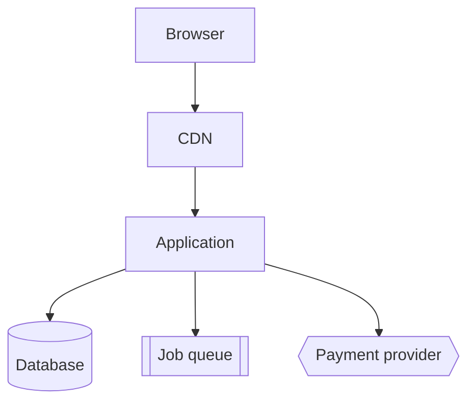
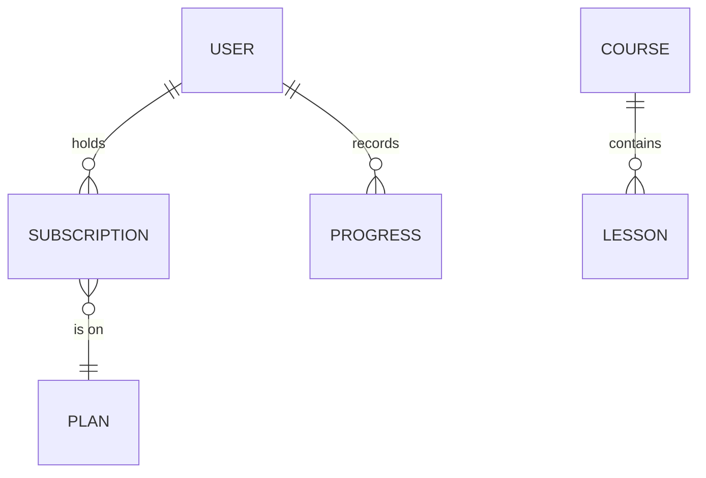
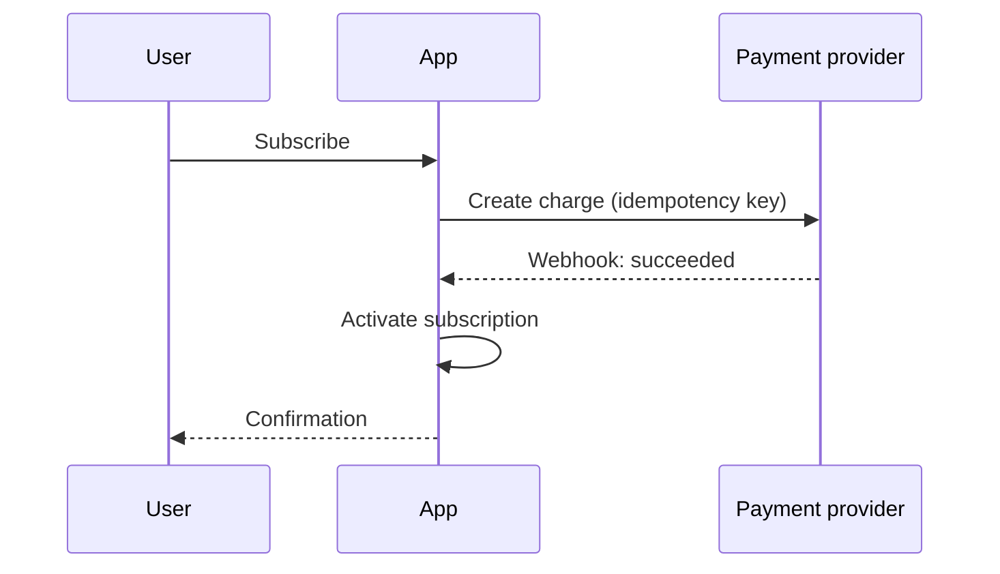

# Diagram Rules

Diagrams are **Mermaid, inside the Markdown document that owns the subject**. Never a binary image,
never an external tool, never a separate diagram file.

## Why Mermaid and nothing else

- It is plain text: an agent can write it, a reviewer can diff it, git can merge it.
- It renders natively in GitHub, GitLab, VS Code, and Claude artifacts.
- It lives beside the prose it illustrates, so it goes stale visibly rather than silently.

A PNG in `docs/` is a diagram nobody will update. Within a month it is a lie with a nice layout.

## Which diagram, where

| Diagram | Type | Lives in |
| --- | --- | --- |
| System boundaries and their traffic | `graph TD` / `graph LR` | `docs/architecture/overview.md` |
| Domain model and relationships | `erDiagram` | `docs/domains/domain-map.md` |
| A critical flow across boundaries | `sequenceDiagram` | `docs/architecture/overview.md` |
| A lifecycle with defined states | `stateDiagram-v2` | The document owning that entity |
| Deployment topology | `graph TD` | `docs/operations/deployment.md` |

**Required minimum for any project past discovery:** one system diagram, one ER diagram, and a
sequence diagram for every flow touching money, authentication, or an external system.

## Examples

System:

````markdown

````

Domain:

````markdown

````

Critical flow:

````markdown

````

## Rules

1. **A diagram states facts, not intentions.** If the system does not work this way yet, label the
   diagram `Proposed` and say when it becomes current.
2. **Label the edges.** An unlabeled arrow between two boxes carries no information.
3. **One diagram, one question.** A diagram answering three questions answers none clearly.
4. **Use the domain vocabulary** from `docs/domains/`. A diagram that renames things creates a
   second vocabulary.
5. **Update the diagram in the same change** that alters what it describes. A stale diagram is
   worse than none: it is trusted.
6. **Keep it under about fifteen nodes.** Past that, split by boundary.
7. **Mark trust boundaries and external systems explicitly** — `{{ }}` for third parties,
   `[( )]` for datastores. A reader must see where your control ends.
8. **No secrets, internal hostnames, IPs, or credentials.** A diagram is documentation and gets
   shared.

## Renaming and deletion

When a boundary is renamed or removed, grep for it across `docs/` before declaring the change done.
A diagram is the easiest place for an old name to survive.
