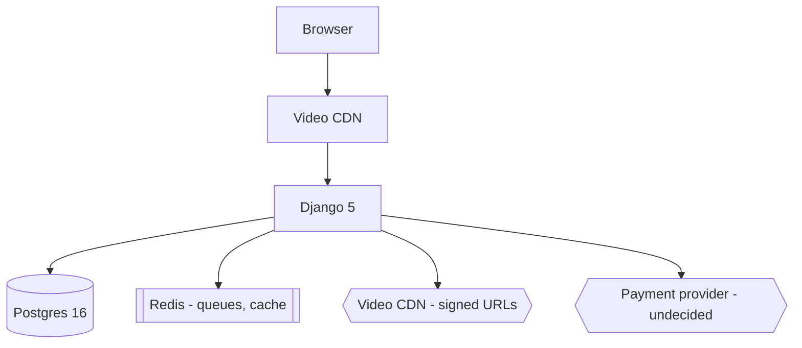
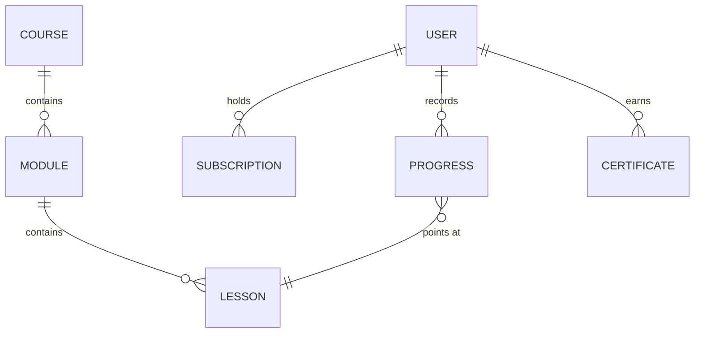
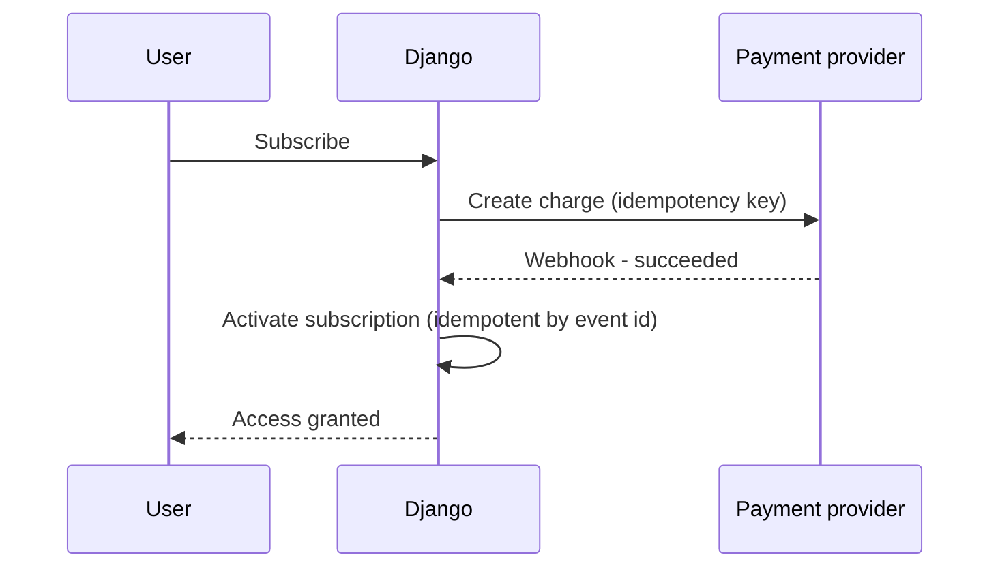

# Discovery Example: a hobbyist ceramics course platform

> **Reference example, not project work.** Every name, number, market, and brand in it is
> invented. It shows the expected depth of a discovery session: how far the questions go, what
> "concrete" means, and how an unknown gets recorded instead of guessed. See `examples/README.md`.

The session opened in an empty directory. `check-placeholders` reported **80 blocking markers**,
so the discovery gate fired before anything else could happen.

---

## Phase 1 — The Idea

> **Q:** What problem does this solve, and for whom specifically?
> **A:** Hobby potters who want structured technique courses. What exists is scattered video with
> no order, no feedback loop, and no way to know what to learn next.

> **Q:** Who is the primary user? Be specific — age, background, situation.
> **A:** 30–60, German-speaking, owns or rents wheel time at a local studio, learns evenings and
> weekends, comfortable paying for a serious course.

> **Q:** Who is explicitly **not** a user?
> **A:** Production potters and art students. Not v1.

> **Q:** What do they do today instead, and why is it not good enough?
> **A:** Free video platforms. No path, no order, no proof they finished anything, and quality
> varies wildly between videos.

> **Q:** What is deliberately out of scope for v1?
> **A:** Live workshops, a mobile app, a community forum, one-to-one critique.

> **Q:** How will you know in six months whether this worked? Name a number.
> **A:** 400 paying subscribers, and 35% of them finish at least one full course.

> **Q:** What already exists — brand, audience, content?
> **A:** An email newsletter with 6,000 subscribers. Brand name and logo exist. About 12 hours of
> workshop footage recorded, not yet edited.

**Written to `docs/product/vision.md`.** Confirmed by the user before phase 2.

---

## Phase 2 — Requirements

> **Q:** Walk me through the first five minutes of a brand-new user.
> **A:** Lands from the newsletter → sees the courses → opens one → watches the first free lesson
> → hits a paywall → subscribes → continues.

> **Q:** What is the core loop the product repeats?
> **A:** Watch a lesson → do the studio exercise → mark complete → next lesson. Progress is
> visible.

> **Q:** What is the minimum that can ship and still be worth paying for?
> **A:** One complete course (about 25 lessons), progress tracking, subscription, certificate on
> completion.

> **Q:** What must never happen?
> **A:** Double-charging a subscriber. Losing progress. Paid video leaking to non-subscribers.

> **Q:** v1, v2, or maybe-never — for each of: photo uploads for exercise results, comments,
> certificates, multiple courses, downloads?
> **A:** Certificates v1. Multiple courses v1 (2 courses). Photo uploads v2. Comments v2.
> Downloads maybe never — leak risk.

> **Q:** What must exist on day one, content-wise?
> **A:** 2 courses, roughly 50 lessons total. Footage already recorded; needs editing.

**Written to `docs/product/requirements.md`.**

---

## Phase 3 — Technology

Three stacks were presented with their trade-offs. Extract:

| Stack | Makes easy | Makes hard | Hosting |
| --- | --- | --- | --- |
| **Django 5 + Postgres** | Auth, admin panel out of the box; matches existing skill | Billing hand-assembled from a library | Any cheap VPS |
| Next.js + Postgres | Fast interface, one language front to back | Auth, billing and admin all hand-built | Vercel, or a VPS with more setup |
| WordPress + LMS plugin | Fastest to launch | Video protection weak; plugin lock-in; painful past ~1k users | Shared hosting |

> **Q:** Team skills, hosting constraints, budget, locale?
> **A:** I know Python. Hosting must be in the EU. Budget under €80/month at the start. Interface
> German-first, English later.

**Recommendation:** Django. It matches existing skill, ships auth and admin without building them,
and runs on a cheap VPS. Next.js would be a better interface at the cost of building everything
the platform needs but the interface.

> **Decision:** Django 5, Postgres 16, a video CDN with signed URLs, Redis for queues.

**Written to `.ai/context/stack.md` with exact versions, plus a decision record —
`2026-03-04-django-over-nextjs-for-v1.md` in the ADR store — recording why Next.js lost, so the
question does not get relitigated every quarter.**

Recorded as unresolved:

```
undecided: payment provider (needs EU invoicing and VAT handling; three candidates, none compared)
  owner: user
  blocks: subscription implementation
  needed by: before the billing task starts, not before architecture
```

---

## Phase 4 — Brand and Interface

> **Q:** Brand exists — give me the exact values.
> **A:** Primary `#3A5A80` (slate blue), accent `#C9772B` (fired clay). Logo is an SVG.

> **Q:** Typeface? It must be readable at 14px on a phone, umlauts included.
> **A:** Source Sans 3, with the system stack as fallback.

> **Q:** Units and notation — kiln temperatures are written three ways in the wild.
> **A:** Show °C with the cone number beside it, always both. Never °F in v1.

> **Q:** Light, dark, or both?
> **A:** Both. Light is the default — lesson photos read better on light.

> **Q:** Accessibility target?
> **A:** WCAG AA. Contrast checked, full keyboard navigation.

> **Q:** Three adjectives, and one product whose feel you admire?
> **A:** Calm, tactile, unhurried. Like a well-made tool catalogue.

**Written to `docs/design/design-system.md`** — hex values, font stack, an 8px spacing scale, and
the temperature-notation rule. Adjectives appear only as a note explaining the choices; the
document itself is values.

---

## Phase 5 — Architecture

Delegated to the `architect` subagent.





Critical flow — the one that touches money:



**Key decisions, each traced to a requirement:**

- Video never served by the app. CDN signed URLs, 4-hour expiry — from "paid video must not
  leak".
- Subscription state is derived from payment events, never set directly — from "never
  double-charge".
- Progress written synchronously, not queued — from "never lose progress".
- No microservices. One deployable. Nothing in the requirements justifies the operational cost.

**Written to `docs/architecture/overview.md` and `docs/domains/domain-map.md`, and the structure
to `.ai/context/scaffold.json`.**

---

## Phase 6 — Constraints

> **Q:** Hosting, region, data residency?
> **A:** VPS in the EU. User data stays in the EU.

> **Q:** Availability target, and expected load?
> **A:** 99% is fine. About 300 users at launch, a few dozen concurrent at peak.

> **Q:** Backup and recovery?
> **A:** Daily database backup, 30-day retention. Video lives at the CDN, not our problem.

> **Q:** Who can deploy, and when?
> **A:** Me. Any time. No approval gate.

> **Q:** Budget ceiling?
> **A:** €80/month to start, up to €200 at 400 users.

> **Q:** Personal data, payments, minors?
> **A:** Email and name only. Payments handled by the provider — no card data touches us. Digital
> content and the 14-day withdrawal right: needs checking.

Recorded:

```
undecided: consumer-law obligations for digital content (withdrawal right, invoicing)
  owner: user, to check with a lawyer
  blocks: nothing in v1 build; must resolve before public launch
```

**Written to `.ai/context/constraints.md`.**

---

## Completion

```
check-placeholders  ->  0 blocking markers
scaffold.ps1 -Apply ->  12 directories created
```

`.ai/context/structure.md` filled from what was created. Backlog written:

```
.ai/tasks/inbox/
├── 2026-03-04-auth-and-registration.md
├── 2026-03-04-course-and-lesson-catalog.md
├── 2026-03-04-video-playback-signed-urls.md
├── 2026-03-04-progress-tracking.md
├── 2026-03-04-subscription-billing.md      (blocked: payment provider undecided)
├── 2026-03-04-certificate-generation.md
└── 2026-03-04-design-system.md
```

Two open questions carried forward with owners. Neither was guessed.

**Elapsed: one session. What it prevented: a platform built on invented requirements — one where
video protection was an afterthought, subscription state was mutable, and every one of these
decisions would have been discovered late, in production, as a bug.**
